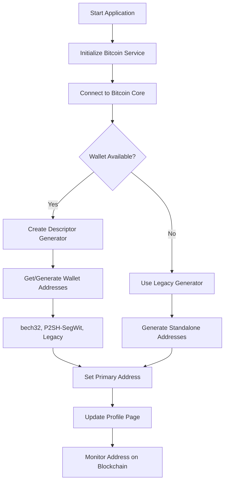

# Bitcoin Core Descriptor Wallet Integration

## Overview

This document summarizes the changes made to integrate Bitcoin Core's descriptor wallet functionality into the Alpha Dashboard application. The system now generates addresses directly from Bitcoin Core's loaded wallet instead of using standalone key generation.

## Key Changes Made

### 1. New Descriptor-Based Address Generator (`app/utils/bitcoin_wallet_descriptor_generator.py`)

**Purpose**: Replace standalone address generation with Bitcoin Core wallet integration

**Key Features**:
- Connects to Bitcoin Core's loaded wallet
- Supports descriptor and legacy wallets
- Generates addresses of all types (bech32, P2SH-SegWit, legacy)
- Validates address ownership
- Retrieves wallet descriptors when available

**Key Methods**:
- `get_wallet_info()` - Get wallet information and descriptor status
- `get_wallet_descriptors()` - Retrieve wallet descriptors (descriptor wallets only)
- `generate_new_address()` - Generate new address from wallet
- `get_wallet_addresses()` - Get all existing wallet addresses
- `get_primary_address()` - Get or generate primary address
- `get_all_address_types()` - Ensure all address types are available
- `validate_address_ownership()` - Verify address belongs to wallet

### 2. Enhanced Bitcoin Service (`services/bitcoin_service.py`)

**Added Descriptor Wallet Support**:
- `get_wallet_descriptors()` - List wallet descriptors
- `generate_wallet_address()` - Generate new wallet address
- `get_wallet_addresses()` - Get all wallet addresses
- `get_address_info()` - Get detailed address information
- `get_all_wallet_address_types()` - Get/generate all address types
- `validate_address_ownership()` - Validate address ownership
- `_detect_address_type()` - Detect address format type

### 3. Updated Profile Page (`app/pages/profile_page.py`)

**Modified Address Generation**:
- Added `bitcoin_service` parameter to constructor
- Added `descriptor_generator` for wallet-based addresses
- Added `wallet_status_label` to show connection status
- Added `setup_descriptor_generator()` method
- Added `load_wallet_addresses()` method
- Added `save_wallet_address_to_profile()` method
- Added `set_bitcoin_service()` method for late binding
- Updated `on_address_type_changed()` to use wallet addresses
- Added fallback to legacy generator when wallet unavailable

### 4. Test Suite (`test_descriptor_wallet_integration.py`)

**Comprehensive Testing**:
- Tests Bitcoin service descriptor methods
- Tests descriptor generator functionality
- Tests profile page integration
- Validates all address types generation
- Verifies address ownership
- Tests wallet connection and status

## New Workflow

### Address Generation Process



### Address Type Switching

1. **Wallet-Based Mode**:
   - Switches between existing wallet addresses
   - Generates missing address types as needed
   - All addresses belong to the same wallet
   - Enables full transaction functionality

2. **Legacy Mode** (fallback):
   - Uses standalone key generation
   - Maintains backward compatibility
   - Limited transaction capabilities

## Benefits

### 1. **Full Bitcoin Core Integration**
- Addresses are owned by Bitcoin Core wallet
- Full transaction capabilities (send/receive)
- Proper UTXO management
- Wallet backup and recovery support

### 2. **Descriptor Wallet Support**
- Modern wallet standard
- Better security and flexibility
- Hierarchical deterministic (HD) addresses
- Advanced scripting capabilities

### 3. **Backward Compatibility**
- Fallback to legacy generator when Bitcoin Core unavailable
- Existing profiles continue to work
- Graceful degradation of functionality

### 4. **Enhanced Security**
- Private keys managed by Bitcoin Core
- Professional wallet security practices
- Hardware wallet integration (via Bitcoin Core)
- Multi-signature support

## Configuration Requirements

### Bitcoin Core Setup
1. **Bitcoin Core running** with RPC enabled
2. **Wallet loaded** (descriptor or legacy)
3. **RPC credentials** configured in `app/config/bitcoin_config.py`
4. **Network access** to Bitcoin Core RPC port

### Fallback Behavior
- If Bitcoin Core unavailable: Uses legacy standalone generator
- If wallet not loaded: Attempts to create/load wallet
- If descriptor operations fail: Falls back to legacy wallet operations

## Testing

Run the integration test:
```bash
python3 test_descriptor_wallet_integration.py
```

**Test Coverage**:
- ✅ Bitcoin Core connection
- ✅ Wallet detection and info
- ✅ Descriptor retrieval (if supported)
- ✅ Address generation (all types)
- ✅ Address ownership validation
- ✅ Profile page integration
- ✅ Fallback mechanisms

## Future Enhancements

1. **Multi-Wallet Support**: Support multiple wallets in Bitcoin Core
2. **Hardware Wallet Integration**: Via Bitcoin Core's hardware wallet support
3. **Multi-Signature Addresses**: Leverage descriptor wallet capabilities
4. **Advanced Scripting**: Custom script types via descriptors
5. **Wallet Import/Export**: Backup and restore wallet descriptors

## Migration Path

### For New Users
- Automatic wallet-based address generation
- Native SegWit (bech32) as default
- Full Bitcoin Core integration

### For Existing Users
- Profiles automatically detect Bitcoin Core availability
- Seamless transition to wallet-based addresses
- Legacy addresses preserved for compatibility
- Manual migration option available

## Technical Details

### Address Types Supported
- **bech32** (bc1...): Native SegWit, lowest fees, most efficient
- **P2SH-SegWit** (3...): SegWit wrapped in P2SH, broad compatibility
- **Legacy** (1...): Traditional P2PKH, maximum compatibility

### Error Handling
- Graceful fallback when Bitcoin Core unavailable
- Clear error messages for configuration issues
- Automatic retry mechanisms for temporary failures
- User-friendly status indicators

### Performance Considerations
- Efficient caching of wallet addresses
- Minimal RPC calls to reduce load
- Background address generation
- Smart connection management

This integration provides a robust foundation for professional Bitcoin wallet functionality while maintaining the flexibility and user-friendliness of the Alpha Dashboard application.